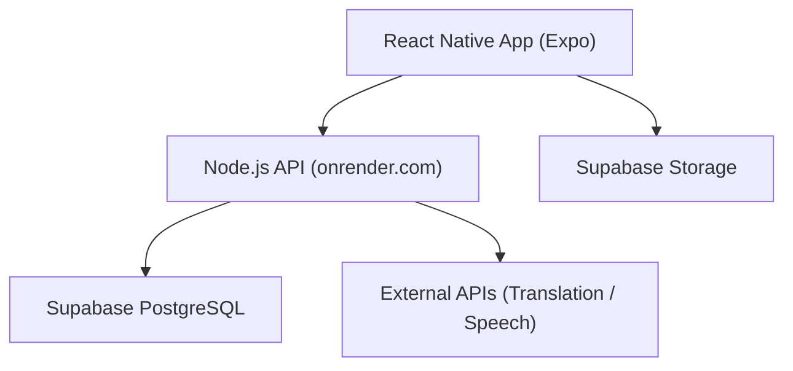

# 타비료코 (Tabiryoko)
### 일본 여행자를 위한 올인원 모바일 어시스턴트

> 여행 일정 관리, 번역, 결제, 지도, 예약 확인 기능을 하나의 앱으로 통합한  
> **React Native 기반 풀스택 모바일 애플리케이션**입니다.  
>  
> 본 프로젝트는 **1인 개발**로 진행되었으며,  
> 향후 기능 확장과 팀 협업을 고려한 **모듈화·확장성 중심의 구조**로 설계되었습니다.

---

## Overview

| 구분 | 내용 |
|---|---|
| 개발 형태 | 1인 풀스택 개발 |
| 플랫폼 | iOS / Android |
| Frontend | React Native (Expo) |
| Backend | Node.js (onrender.com) |
| Database | Supabase (PostgreSQL) |
| Storage | Supabase Storage |

---

## Architecture

### 설계 의도
- 클라이언트는 UI/UX와 사용자 상호작용에 집중
- 서버는 비즈니스 로직과 외부 API 연동 담당
- 데이터베이스와 파일 스토리지를 분리하여 보안성과 확장성 확보

---

## Tech Stack

### Frontend
- React Native (Expo)
- Expo Router 기반 화면 구조
- Context 기반 상태 관리
- FlatList 기반 커스텀 UI 설계

### Backend
- Node.js (REST API)
- onrender.com 배포
- 외부 번역·음성 API 연동

### Database / Storage
- Supabase (PostgreSQL)
- Supabase Storage
- Row Level Security 기반 접근 제어

---

## Core Features

### 일정 관리
- 날짜 중심 일정 구조
- 날짜 선택 시 해당 일정 카드로 자동 이동
- 라이브러리 의존도를 낮춘 커스텀 UI

### 번역 기능
- 텍스트 / 음성 / 이미지 번역
- 사용자 요청 기반 API 호출로 비용 최적화

### 결제 모듈
- 결제 수단 선택 모달 구조
- 확장 가능한 결제 플로우 설계

### 이미지 업로드
- 모바일 환경에 최적화된 이미지 업로드
- Supabase Storage 직접 연동

---

## Technical Challenges

### 모바일 이미지 업로드 최적화
- 이미지 리사이즈 및 압축 후 업로드
- 업로드 실패 시 재시도 UX 제공

### Supabase 권한 모델 설계
- 사용자별 데이터 접근 제어
- Storage 정책과 RLS 결합

### UI 구조 모듈화
- 기능 단위 모달 분리
- 확장 및 유지보수를 고려한 구조 설계

---

## Developer Role

- 전체 아키텍처 설계
- 프론트엔드 UI/UX 구현
- 백엔드 API 설계 및 배포
- DB 모델링 및 권한 정책 설계
