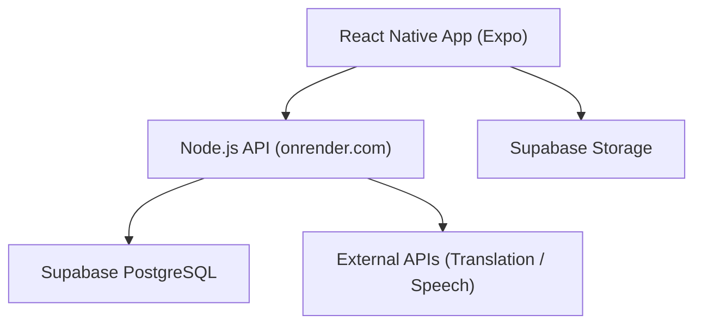

# 타비료코 (Tabiryoko)
### 일본 여행자를 위한 올인원 모바일 어시스턴트

> 여행 일정 관리, 번역, 결제, 지도, 예약 확인 기능을 하나의 앱으로 통합한  
> **React Native 기반 풀스택 모바일 애플리케이션**입니다.  
>  
> 본 프로젝트는 **1인 개발**로 진행되었으며,  
> 향후 기능 확장과 팀 협업을 고려한 **모듈화·확장성 중심의 구조**로 설계되었습니다.

---

## Demo Video

https://github.com/user-attachments/assets/4ecc5632-45ca-4eb0-b864-df728cb4a8d8

---

## Overview

| 구분 | 내용 |
|---|---|
| 개발 형태 | 1인 풀스택 개발 |
| 플랫폼 | iOS / Android |
| Frontend | React Native (Expo) |
| Backend | Node.js (onrender.com) |
| Database | Supabase (PostgreSQL) |
| Storage | Supabase Storage |

---

## Architecture


```mermaid
flowchart TD
    A["React Native App (Expo)"] --> B["Node.js API (onrender.com)"]
    B --> C["Supabase PostgreSQL"]
    A --> D["Supabase Storage"]
    B --> E["External APIs (Translation / Speech)"]
```

### 설계 의도
- 클라이언트는 UI/UX와 사용자 상호작용에 집중
- 서버는 비즈니스 로직과 외부 API 연동 담당
- 데이터베이스와 파일 스토리지를 분리하여 보안성과 확장성 확보

---


## Tech Stack

### Frontend
- React Native (Expo)
- Expo Router 기반 화면 구조
- Context 기반 상태 관리
- FlatList 기반 커스텀 UI 설계

- [Expo on GitHub](https://github.com/expo/expo): View our open source platform and contribute.
- [Discord community](https://chat.expo.dev): Chat with Expo users and ask questions.

```
TripJapan
├─ .env
├─ apis
├─ app.json
├─ App.tsx
├─ assets
│  ├─ fonts
│  │  └─ SpaceMono-Regular.ttf
│  ├─ icons
│  │  ├─ backarrow.png
│  │  ├─ map.png
│  │  ├─ navigate.png
│  │  ├─ search.png
│  │  └─ share.png
│  └─ images
│     ├─ ad1.png
│     ├─ ad2.png
│     ├─ ad3.png
│     ├─ ad4.png
│     ├─ adaptive-icon.png
│     ├─ favicon.png
│     ├─ icon.png
│     ├─ partial-react-logo.png
│     ├─ react-logo.png
│     ├─ react-logo@2x.png
│     ├─ react-logo@3x.png
│     └─ splash-icon.png
├─ babel.config.js
├─ components
│  ├─ Calendar.tsx
│  ├─ Collapsible.tsx
│  ├─ CustomTabButton.tsx
│  ├─ ExternalLink.tsx
│  ├─ FAB.tsx
│  ├─ FlightList.tsx
│  ├─ HapticTab.tsx
│  ├─ Header
│  │  ├─ BackwardButton.tsx
│  │  ├─ Header.tsx
│  │  ├─ MapButton.tsx
│  │  ├─ MovetoButton.tsx
│  │  ├─ SearchButton.tsx
│  │  ├─ ShareButton.tsx
│  │  └─ styles.ts
│  ├─ HotelList.tsx
│  ├─ indexProps
│  │  └─ Imageslides.tsx
│  ├─ JapanMap copy.tsx
│  ├─ JapanMap.tsx
│  ├─ jp_regions.ts
│  ├─ KakaoLogin.tsx
│  ├─ mapProps
│  │  └─ Mapwebview.tsx
│  ├─ ParallaxScrollView.tsx
│  ├─ Popupads.tsx
│  ├─ ScheduleCard.tsx
│  ├─ ScheduleList.tsx
│  ├─ ScheduleMapCalendar.tsx
│  ├─ Slides.tsx
│  ├─ ThemedText.tsx
│  ├─ ThemedView.tsx
│  ├─ Tips.tsx
│  ├─ ToggleMenuButton.tsx
│  ├─ Tomytrip.tsx
│  └─ ui
│     ├─ IconSymbol.ios.tsx
│     ├─ IconSymbol.tsx
│     ├─ TabBarBackground.ios.tsx
│     └─ TabBarBackground.tsx
├─ eas.json
├─ hooks
│  ├─ useColorScheme.ts
│  ├─ useColorScheme.web.ts
│  └─ useThemeColor.ts
├─ index.js
├─ jp.geojson
├─ modals
│  ├─ BookingModal
│  ├─ PaymentModal
│  └─ TranslationModal
├─ navigation
│  ├─ AuthStack.tsx
│  ├─ CommunityStackNavigator.tsx
│  ├─ HomeStackNavigator.tsx
│  ├─ MainTabNavigator.tsx
│  ├─ ScheduleStackNavigator.tsx
│  ├─ SearchStackNavigator.tsx
│  └─ SettingsStackNavigator.tsx
├─ package-lock.json
├─ package.json
├─ README.md
├─ screens
│  ├─ auth
│  │  ├─ LoginScreen.tsx
│  │  └─ SignupScreen.tsx
│  ├─ community
│  │  ├─ CommentScreen.tsx
│  │  ├─ CommunityScreen.tsx
│  │  └─ PostCreateScreen.tsx
│  ├─ fab
│  │  ├─ booking
│  │  │  ├─ BookingCardList.tsx
│  │  │  └─ BookingModal.tsx
│  │  ├─ payment
│  │  │  ├─ CreditCardScreen.tsx
│  │  │  ├─ PaymentMethodSelectScreen.tsx
│  │  │  ├─ PaymentModal.tsx
│  │  │  ├─ PayPayScreen.tsx
│  │  │  └─ TransitCardScreen.tsx
│  │  └─ translation
│  │     ├─ ImageTranslationScreen.tsx
│  │     ├─ TextTranslationScreen.tsx
│  │     ├─ TranslationMethodSelectScreen.tsx
│  │     ├─ TranslationModal.tsx
│  │     └─ VoiceTranslationScreen.tsx
│  ├─ home
│  │  ├─ AttracitonDetailScreen.tsx
│  │  ├─ HomeScreen.tsx
│  │  ├─ ReviewScreen.tsx
│  │  ├─ TravelDetailScreen.tsx
│  │  └─ TravelEditScreen.tsx
│  ├─ schedules
│  │  ├─ AddTripScreen.tsx
│  │  ├─ ScheduleDetailScreen.tsx
│  │  ├─ SchedulingScreen.tsx
│  │  └─ TripHistoryScreen.tsx
│  ├─ search
│  │  ├─ DetailScreen.tsx
│  │  ├─ japandata.json
│  │  └─ SearchHomeScreen.tsx
│  └─ settings
│     ├─ NoticeScreen.tsx
│     ├─ NotificationScreen.tsx
│     ├─ PaymentScreen.tsx
│     ├─ PolicyScreen.tsx
│     ├─ ProfileEditScreen.tsx
│     ├─ SettingsScreen.tsx
│     ├─ SupportScreen.tsx
│     └─ VersionInfoScreen.tsx
├─ scripts
│  └─ reset-project.js
├─ server
│  ├─ .env
│  ├─ server.js
│  └─ uploads
│     ├─ translated-1755620044194.png
│     ├─ translated-1755620076333.png
│     ├─ translated-1755620094318.png
│     ├─ translated-1755620206718.png
│     ├─ translated-1755620272428.png
│     ├─ translated-1755620290451.png
│     ├─ translated-1755620302432.png
│     ├─ translated-1755620441215.png
│     ├─ translated-1755620619767.png
│     ├─ translated-1755620799486.png
│     ├─ translated-1755621002926.png
│     ├─ translated-1755621064095.png
│     ├─ translated-1755621334885.png
│     └─ translated-1755621538698.png
├─ tsconfig.json
├─ types
│  ├─ react-native-image-slider-box
│  │  └─ index.d.ts
│  └─ react-native-xml2js
│     └─ index.d.ts
└─ utils
   └─ constants
      └─ Colors.ts

```
