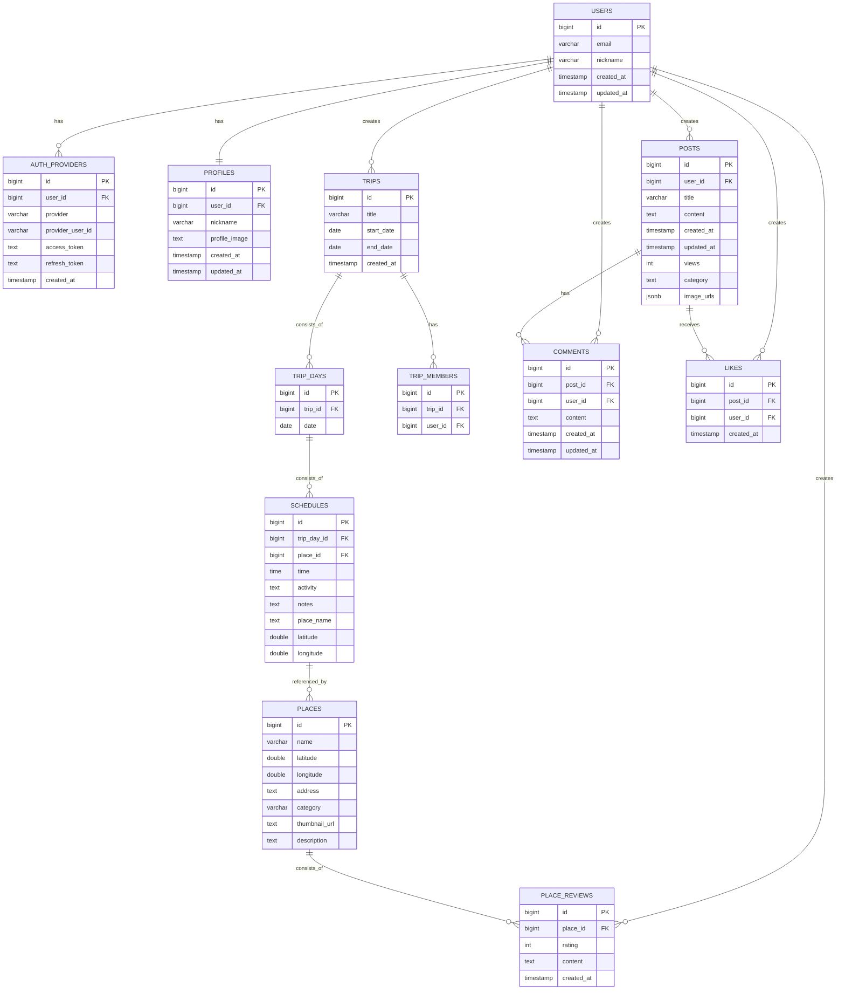

# 타비료코 (Tabiryoko)
### 일본 여행자를 위한 올인원 모바일 어시스턴트

> 여행 일정 관리, 번역, 결제, 지도, 예약 확인 기능을 하나의 앱으로 통합한  
> **React Native 기반 풀스택 모바일 애플리케이션**입니다.  
>  
> 본 프로젝트는 **1인 개발**로 진행되었으며,  
> 향후 기능 확장과 팀 협업을 고려한 **모듈화·확장성 중심의 구조**로 설계되었습니다.

---

## Overview

| 구분 | 내용 |
|---|---|
| 개발 형태 | 1인 풀스택 개발 |
| 플랫폼 | iOS / Android |
| Frontend | React Native (Expo) |
| Backend | Node.js (onrender.com) |
| Database | Supabase (PostgreSQL) |
| Storage | Supabase Storage |

---

## Architecture

### 설계 의도
- 클라이언트는 UI/UX와 사용자 상호작용에 집중
- 서버는 비즈니스 로직과 외부 API 연동 담당
- 데이터베이스와 파일 스토리지를 분리하여 보안성과 확장성 확보

---

## Tech Stack

### Frontend
- React Native (Expo)
- Expo Router 기반 화면 구조
- Context 기반 상태 관리
- FlatList 기반 커스텀 UI 설계

### Backend
- Node.js (REST API)
- onrender.com 배포
- 외부 번역·음성 API 연동

### Database / Storage
- Supabase (PostgreSQL)
- Supabase Storage
- Row Level Security 기반 접근 제어

---

## Core Features

### 일정 관리
- 날짜 중심 일정 구조
- 날짜 선택 시 해당 일정 카드로 자동 이동
- 라이브러리 의존도를 낮춘 커스텀 UI

### 장소 검색
- 여행지 중심 장소 탐색 구조
- 장소 상세 화면에서 리뷰 및 관련 여행 연결
- 장소 데이터를 독립 도메인으로 관리하여 재사용성 확보

### 커뮤니티
- 여행 경험 공유를 위한 게시글 중심 구조
- 게시글에 대한 댓글 및 좋아요 기능
- 사용자 활동 이력을 고려한 관계 테이블 기반 설계

---
## Database-Centered Domain Design

본 프로젝트는 **User를 중심으로 한 3개의 핵심 도메인**을 기준으로 설계되었습니다.

- **Trip**: 여행 일정과 여행 참여 관계
- **Place**: 여행 중 방문 장소 및 장소 기반 기록
- **Post**: 여행 경험을 공유하는 커뮤니티 콘텐츠

각 도메인은 독립적인 책임을 가지면서도,  
User를 기준으로 서로 유기적인 관계를 형성합니다.

---

## Database Design (ERD)

아래 ERD는 실제 `supabase.ts`의 테이블 구조를 기준으로 정리한 관계도입니다.

---

## ERD 설계 설명 (DBA Perspective)

### 1. User 중심 설계
- Supabase Auth 영역과 서비스 영역을 분리
- 인증 정보와 서비스 데이터의 책임을 명확히 구분
- 모든 핵심 도메인은 User를 기준으로 접근 제어 가능

### 2. Trip 도메인 설계
- trips를 여행 컨텍스트의 최상위 엔티티로 설정
- 날짜와 일정을 분리하여 날짜 기준 조회 성능 확보
- 단일/다인 여행 모두 대응 가능

### 3. Place 도메인 설계
- places는 독립적인 장소 마스터 데이터
- 여행과의 관계는 연결 테이블을 통해 관리
- 장소 리뷰는 User-Place 직접 관계로 유지

### 4. Post 도메인 설계
- 게시글을 중심으로 댓글과 좋아요를 분리
- 사용자 활동 이력 추적과 확장에 유리한 구조

---

## Developer Role
- 전체 도메인 모델링 및 ERD 설계
- Supabase 기반 인증 및 데이터 구조 설계
- React Native UI 구조와 DB 구조 간 정합성 유지
- API 설계 및 데이터 접근 패턴 정의
